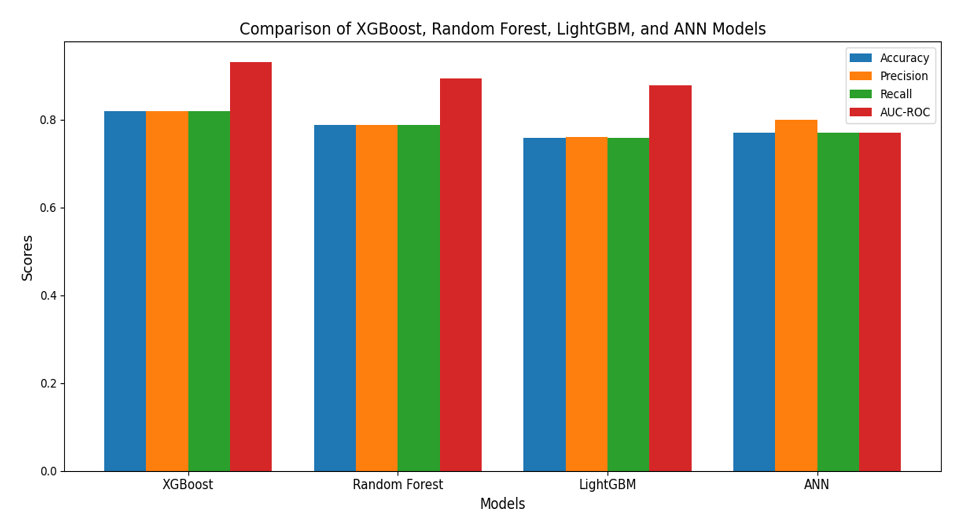
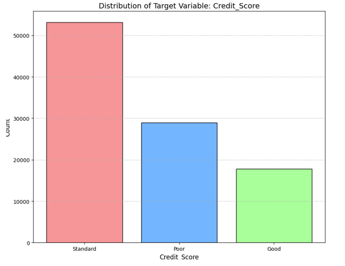

# Credit-Health-Checker

The Credit Health Checker project explores the application of machine learning and deep learning techniques to enhance credit score classification. Using a comprehensive dataset containing financial and demographic features, we implemented and compared the performance of four models: XGBoost, Random Forest, LightGBM, and a sequential deep learning model. The CRISP-DM methodology was followed to ensure a structured approach, including data preprocessing, feature engineering, model optimization, and evaluation. Results showed that XGBoost achieved the highest accuracy (82.0%) and AUC-ROC (93.1%), while the optimized Random Forest and LightGBM models demonstrated competitive performance. The deep learning model further identified hidden patterns, improving predictive insights for credit scoring. This project highlights the importance of advanced algorithms in enhancing risk assessment, improving creditworthiness evaluation, and supporting financial institutions in decision-making processes.
